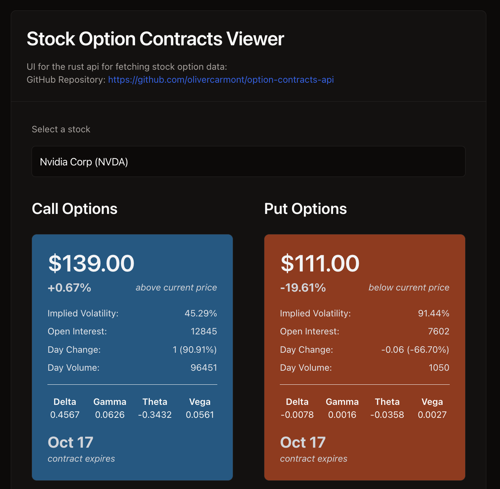

# Clyo.lat: An Option Contracts UI

Check it out at **[clyo.lat](https://clyo.lat)**



## API

This project uses a custom Rust API for fetching stock option data. The API repository can be found at:
[https://github.com/olivercarmont/option-contracts-api](https://github.com/olivercarmont/option-contracts-api)

## Features

- UI for option contract api
- Info displayed for each contract:
  - Strike price
  - Implied volatility
  - Open interest
  - Day change
  - Day volume
  - Greeks (Delta, Gamma, Theta, Vega)
- Contract expiry date

## Setup and Installation

1. Clone the repository
2. Install dependencies:
   ```
   npm install
   ```
3. Set up environment variables:
   - Create a `.env.local` file in the root directory
   - Add your Polygon API key:
     ```
     POLYGON_API_KEY=your_api_key_here
     ```
4. Run the development server:
   ```
   npm run dev
   ```
5. Open [http://localhost:3000](http://localhost:3000) in your browser

## Special thanks to
- [Fuse.js](https://fusejs.io/)
- [Polygon.io](https://polygon.io/)
